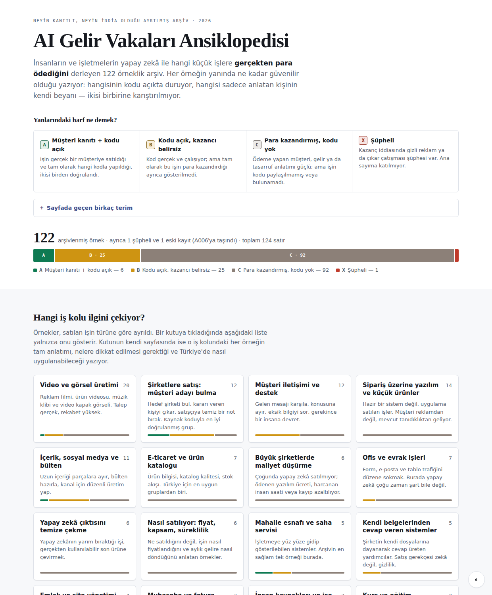

<div align="center">

# AI Gelir Vakaları Ansiklopedisi

**Yapay zekâyla para kazanıldığı bildirilen 122 gerçek işin, her birinin ne kadar kanıtlı olduğu işaretlenmiş arşivi.**

[](https://paradoksix.github.io/ai-money-workflows/)
[](https://github.com/paradoksix/ai-money-workflows/actions/workflows/validate-catalog.yml)
[](ENCYCLOPEDIA.md)
[](ENCYCLOPEDIA.md)
[](#a--kaynağı-doğrulanmış-örnekler)
[](LICENSE)

[**Atlas sayfası**](https://paradoksix.github.io/ai-money-workflows/) · [İş kolları](ENCYCLOPEDIA.md) · [Ortak dersler](encyclopedia/DESENLER.md) · [Ölçütler](RESEARCH_POLICY.md) · [Ham veri](data/cases.csv)

</div>

> **In English —** An evidence-graded archive of 122 documented cases where people or businesses reportedly made money with AI and automation. Every case carries a letter (A/B/C/X) recording *how well it is actually proven*: whether the source code behind the claim was found and pinned, or whether the figure is only the claimant's own word. Revenue types are kept strictly apart — a freelancer's fee, product revenue, a client's saving and other commercial outcomes are never blended into one number. Written in Turkish, with a note under each case on how it might be adapted for the Turkish market. This is a research record, not investment or income advice.

---

<div align="center">
  <a href="https://paradoksix.github.io/ai-money-workflows/">
    
  </a>
  <br>
  <sub><b><a href="https://paradoksix.github.io/ai-money-workflows/">paradoksix.github.io/ai-money-workflows</a></b> — arama ve dört filtreyle 122 örnek arasında gezinilebilen tek sayfa</sub>
</div>

---

## Bu repo ne, ne değil

İnternette "yapay zekâ ile şu kadar kazandım" anlatısı sonsuz. Sorun anlatının çokluğu değil, **hangisinin gerçekten doğrulanabildiğinin belli olmaması.**

Bu arşiv tam olarak o ayrımı yapmak için var. Her örneğin yanında bir harf duruyor ve o harf tek bir soruyu cevaplıyor: *bu iddianın arkasında ne kadar sağlam bir kanıt var?* Kodu bulunup sürümü sabitlenmiş bir iş ile, yalnızca bir forum gönderisinde anlatılmış bir rakam aynı torbaya konmuyor.

| Bu repo… | …bu repo değil |
|---|---|
| Kanıt derecesi işaretlenmiş bir araştırma kaydı | "Zengin olmanın 122 yolu" listesi |
| Rakamların **türünü** ayıran bir defter (ücret / gelir / tasarruf / diğer) | Gelir vaadi veya yatırım tavsiyesi |
| Kaynak koduna sürüm numarasıyla işaret eden bir dizin | Başkasının kodunu barındıran bir depo |
| Türkiye'ye uyarlama notları taşıyan bir başlangıç noktası | Hazır iş planı |

Rakamların neredeyse tamamı **işi yapan kişilerin kendi beyanı** ve hiçbiri bağımsız denetlenmedi. Arşiv bunu gizlemek yerine her örnekte açıkça işaretliyor.

## Nereden başlamalı?

| Ne istiyorsun | Nereye git |
|---|---|
| **Gezinmek, filtrelemek, bir iş kolu seçmek** | [**Atlas sayfası**](https://paradoksix.github.io/ai-money-workflows/) — arama + iş kolu, güvenilirlik, gelir türü ve Türkiye filtreleri |
| Bir iş kolunu baştan sona okumak | [`ENCYCLOPEDIA.md`](ENCYCLOPEDIA.md) — 16 iş kolunun listesi |
| Örneklerin tamamından çıkan ortak dersler | [`encyclopedia/DESENLER.md`](encyclopedia/DESENLER.md) |
| Neyin nasıl doğrulandığını anlamak | [`RESEARCH_POLICY.md`](RESEARCH_POLICY.md) |
| Veriyi kendin analiz etmek | [`data/cases.csv`](data/cases.csv) — 124 kaydın tamamı |
| Kaynağı hâlâ aranan örneklere bakmak | [`research_queue.csv`](research_queue.csv) + [`research/`](research/) |
| Türkiye'de satış açılarını görmek | [`TURKIYE_OPPORTUNITIES.md`](TURKIYE_OPPORTUNITIES.md) |

## Yanlarındaki harf ne demek?

Her örnek dört güvenilirlik seviyesinden birini taşır. Harf, işin *ne kadar iyi* olduğunu değil, **iddianın ne kadar doğrulanabildiğini** anlatır.

| | Ne demek | Ne doğrulandı |
|:--:|---|---|
| **A** | Müşteri kanıtı + kodu açık | İşin gerçek bir müşteriye satıldığı **ve** tam olarak hangi kodla yapıldığı, ikisi birden |
| **B** | Kodu açık, kazancı belirsiz | Kod gerçek ve çalışıyor; ama tam olarak bu işin para kazandırdığı ayrıca gösterilmedi |
| **C** | Para kazandırmış, kodu yok | Ödeme yapan müşteri veya tasarruf anlatımı güçlü; ama işin kodu paylaşılmamış ya da bulunamadı |
| **X** | Şüpheli | Kazanç iddiasında gizli reklam veya çıkar çatışması şüphesi var — ana sayıma katılmaz |

Rakamlarda ise birbirine benzeyen dört ayrı şey asla karıştırılmaz:

| | | |
|:--:|---|---|
| **F** | İşi yapana ödenen ücret | Hizmeti verenin cebine giren para |
| **R** | Üründen gelen gelir | Satılan ürün veya abonelik geliri |
| **S** | Müşterinin tasarrufu | Müşterinin kazandığı zaman ya da kestiği gider |
| **V** | Başka ticari sonuç | Kampanya değeri, alınan randevu, görüntülenme, tahsil edilen alacak |

Bir kampanyanın bütçesi ile freelancerın aldığı ücret aynı şey değildir; arşiv bu ikisini aynı hücreye yazmaz.

## Rakamlarla arşiv

| | |
|---|---|
| Arşivlenmiş örnek | **122** — ayrıca 1 şüpheli ve 1 eski kayıt, toplam 124 satır |
| Güvenilirlik dağılımı | A: 6 · B: 25 · C: 92 · X: 1 |
| İş kolu | 16 (+ şüpheliler eki) |
| Kaynak kodu sabitlenmiş | 9 kayıt (depo adresi + doğrulanmış sürüm) |
| Kaynak bağlantısı olan | 59 kayıt |
| Gelir türü dağılımı | F: 61 · S: 16 · R: 9 · V: 5 |
| Türkiye'ye uygunluk | Yüksek: 51 · Orta: 60 · Düşük: 13 |

## A — Kaynağı doğrulanmış örnekler

Altı örnekte hem ticari sonuç hem de o sonucu üreten kod doğrulandı. Kod bu depoya kopyalanmadı; adresi ve sabitlenmiş sürümüyle referans veriliyor.

| | İş | Kaynak deposu | Sabitlenen sürüm | Bildirilen sonuç |
|:--:|---|---|:--:|---|
| **A001** | Moda kampanyası için reklam görseli üretimi | [`sirlifehacker/Nano-Banana-Pro-Creative-Director`](https://github.com/sirlifehacker/Nano-Banana-Pro-Creative-Director) | `1c82b35` | $9K'lık kampanya (bu paranın ne kadarının işi yapana kaldığı belirsiz) |
| **A002** | İş ilanından karar verici araştırması | [`sirlifehacker/n8n-automations`](https://github.com/sirlifehacker/n8n-automations) | `dcab491` | İlk müşteriden sonra birden fazla müşteri daha |
| **A003** | Şirket bulup puanlayan araştırma motoru | [`sirlifehacker/lead-gen-hacker`](https://github.com/sirlifehacker/lead-gen-hacker) | `9ed891f` | Girişimciler çeşitli sürümleri için ödeme yapmış |
| **A004** | Gündem takibinden içerik fırsatı çıkarma | [`sirlifehacker/social-story-scraper`](https://github.com/sirlifehacker/social-story-scraper) | `69de288` | ~2,9M görüntülenme, 10+ yüksek bütçeli müşteri adayı |
| **A005** | Hukuk firmasına müşteri adayı bulma | [`lucaswalter/n8n-ai-automations`](https://github.com/lucaswalter/n8n-ai-automations) | `08e33b6` | **$1.800**'e satılmış; normal fiyatı $2.500 + aylık $400 |
| **A006** | Cihaz tamir servisinde WhatsApp + sesli karşılama | [`santifer/jacobo-workflows`](https://github.com/santifer/jacobo-workflows) | `b26601d` | Müşterilerin ~%90'ı kendi kendine hallediyor; ayda ~80 saat kazanç |

**A006** arşivin en sağlam örneği: yedi parçalı, iki yıl canlı çalışmış, işletme satıldığında yeni sahibi kullanmaya devam etmiş bir sistem. Ayrıntılı kartı → [`encyclopedia/A006-JACOBO-DEVICE-REPAIR.md`](encyclopedia/A006-JACOBO-DEVICE-REPAIR.md)

## Repo yapısı

**Okuma katmanı**

| Dosya | İçerik |
|---|---|
| [`ENCYCLOPEDIA.md`](ENCYCLOPEDIA.md) | İş kolları listesi ve harflerin anlamı |
| [`encyclopedia/nis-01…16-*.md`](encyclopedia/) | 16 iş kolu dosyası; her örneğin tam anlatımı, riskleri ve Türkiye uyarlaması |
| [`encyclopedia/DESENLER.md`](encyclopedia/DESENLER.md) | Örnek gruplarının tamamından çıkan ortak dersler |
| [`encyclopedia/A006-JACOBO-DEVICE-REPAIR.md`](encyclopedia/A006-JACOBO-DEVICE-REPAIR.md) | En sağlam tek örneğin ayrıntılı kartı |
| [`encyclopedia/APPENDIX-X-DISPUTED.md`](encyclopedia/APPENDIX-X-DISPUTED.md) | Şüpheli iddialar; kırmızı bayrak eğitimi olarak saklanır |

**Veri katmanı**

| Dosya | İçerik |
|---|---|
| [`data/cases.csv`](data/cases.csv) | 124 kaydın tamamı: iş kolu, güvenilirlik harfi, gelir türü, tutar, kullanılan araçlar, zorluk, Türkiye'ye uygunluk, kaynak bağlantıları, özet |
| [`catalog.csv`](catalog.csv) | Kaynağı sabitlenmiş çekirdek (42 kayıt): depo adresi ve doğrulanmış sürüm taşıyan daha sıkı alt küme |
| [`research_queue.csv`](research_queue.csv) | Kaynak kodu hâlâ bulunamamış, değerli örneklerin araştırma listesi |
| [`sources.csv`](sources.csv) | İlk kaynak indeksinin geriye dönük kopyası |

**Araç katmanı**

| Dosya | Ne yapar |
|---|---|
| [`docs/index.html`](docs/index.html) | Üretilmiş atlas sayfası ([canlı hâli](https://paradoksix.github.io/ai-money-workflows/)) — **elle düzenlenmez** |
| [`scripts/build_site.py`](scripts/build_site.py) | Sayfayı `data/cases.csv`'den üretir; deterministiktir |
| [`scripts/validate_cases.py`](scripts/validate_cases.py) | Veri yapısı, `catalog.csv` ile alan uyumu ve her örneğin yazıldığı yerde olduğu kontrolü |
| [`scripts/validate_catalog.py`](scripts/validate_catalog.py) | Çekirdek katalog tutarlılık kontrolü |
| [`builds/catalog-doctor/`](builds/catalog-doctor/) | Geniş ürün kataloglarını denetleyen çalışan araç; kendi testi CI'da koşar |
| `clone_originals.sh` / `.ps1` | Doğrulanmış kaynak depolarını sabit sürüme kilitleyerek indirir |
| `clone_disputed.sh` / `.ps1` | Şüpheli örnekleri bilerek ayrı indirir |

**Strateji notları**

[`RESEARCH_POLICY.md`](RESEARCH_POLICY.md) — güvenilirlik ölçütleri ve lisans politikası · [`TURKIYE_OPPORTUNITIES.md`](TURKIYE_OPPORTUNITIES.md) — yerel satış açıları · [`BUILD_SHORTLIST.md`](BUILD_SHORTLIST.md) — duraklatılmış build listesi

## Veriyle çalışmak

Python 3.12 dışında bağımlılık yok.

```bash
# Veri bütünlüğünü doğrula
python3 scripts/validate_catalog.py    # kaynağı sabitlenmiş çekirdek
python3 scripts/validate_cases.py      # 124 kayıt + iki çapraz kontrol

# Atlas sayfasını yeniden üret (deterministik: aynı veri = aynı çıktı)
python3 scripts/build_site.py

# Doğrulanmış upstream depoları sabit sürümle indir
./clone_originals.sh                   # Windows: .\clone_originals.ps1

# Katalog denetleme aracını örnek veriyle çalıştır
cd builds/catalog-doctor && python3 catalog_doctor.py sample_catalog.csv --out demo-output
```

`scripts/validate_cases.py` iki dosyanın sessizce ayrışmasını engeller: `catalog.csv`'deki her kaydın `cases.csv`'de de bulunduğunu ve ortak alanların birebir aynı olduğunu; ayrıca her örneğin gerçekten kendi iş kolu dosyasında yazılı olduğunu doğrular. CI ayrıca `docs/index.html`'in veriye göre güncel olduğunu kontrol eder.

**Sayfa nerede yayında?** [paradoksix.github.io/ai-money-workflows](https://paradoksix.github.io/ai-money-workflows/) — `main` dalındaki `docs/` klasöründen GitHub Pages ile servis ediliyor, her push'ta kendiliğinden güncelleniyor. `docs/index.html` tek başına çalışan bir dosya olduğu için yerelde çift tıklayarak da açabilirsiniz.

## Bir örnek arşive nasıl giriyor?

Tek bir ekran görüntüsü kanıt sayılmaz. Bir örneğin kaydedilmesi için sırasıyla şunlar aranır:

1. **Net bir müşteri problemi** — kim, neyi, neden ödedi?
2. **Çalışan sistemin anlatımı** — hangi parçalar, nerede insan devreye giriyor?
3. **Ticari sonuç** — ve o rakamın türü (F / R / S / V) net biçimde ayrılmış hâlde.
4. **İşin kaynak kodu** — bulunabiliyorsa adresi ve sürüm numarasıyla.
5. **Kodun geçmişi ve lisansı** — herkese açık olması kullanma izni vermez.
6. **Mümkünse ikinci bağımsız işaret** — aynı hikâyenin başka hesapta farklı rakamla tekrarı doğrulama değil, **kırmızı bayraktır**.

Ayrıntılı ölçütler → [`RESEARCH_POLICY.md`](RESEARCH_POLICY.md). Kaynağı hâlâ aranan örnekler → [`research_queue.csv`](research_queue.csv).

## Proje durumu

Arşiv **122 örnekte**; hedef, aynı ölçütleri gevşetmeden 150–200 bandına kontrollü biçimde ilerlemek. Tek bir ürün geliştirmeye odaklanan build dalgası şu aşamada **duraklatılmış** durumda.

En çok değer taşıyan üç açık ipucu:

- **C004** — Alman site yönetimi otomasyon şirketi; ticari sürekliliği güçlü, resmî kaynak kodu bulunamadı.
- **C003** — 50 bin ürünlük katalog düzenleme; `conor-is-my-name` teknik olarak uyumlu ama **doğrulanmamış** aday.
- **C002** — Japon reklam faturası işleme; kaynak kodu ve panel izi hâlâ yok.

Tam liste ve gerekçeler → [`ENCYCLOPEDIA.md`](ENCYCLOPEDIA.md) · derin araştırma raporları → [`research/`](research/)

## Lisans

Bu deponun **kendi** araştırma metni, veri dosyaları ve scriptleri [Creative Commons Attribution 4.0](LICENSE) (CC BY 4.0) altındadır — atıf vererek kullanabilirsiniz.

Atıf verilen **upstream projelerin kodu bu lisansın dışındadır.** O kodların hiçbiri depoya kopyalanmadı; yalnızca adres ve doğrulanmış sürüm numarası olarak referans verildi. Her biri kendi şartlarına tabidir ve çoğunun kök dizininde açık bir lisans dosyası bulunmuyor — bir projeyi kullanmadan önce kendi lisans durumunu ayrıca kontrol edin. Ücretli veya özel kaynaklar araştırma amacıyla kayda geçirilir, kopyalanmaz.
